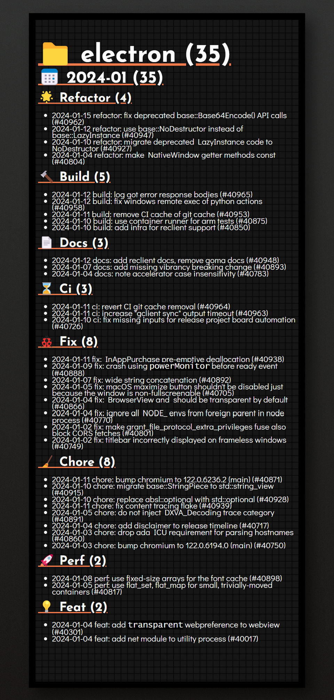

<h1 align="center">Annualized</h1>
<p align="center">
    <b>Node.js CLI based on git commit for annual contribute index, generates Markdown</b>
</p>

---

<p align="center">
    
    
    <a href="LICENSE">
        
    </a>
</p>

<p align="center">English | <a href="README.md">简体中文</a></p>

## 📖 Introduction

`Annualized` not only summarizes the submission tree of the project, it also focuses on in
dividual contributions.

See [Markdown Demo](example/example.md), or screenshot:



## ⚙️ Installation

1. Clone the repository

```shell
git clone https://github.com/kabeep/annualize.git
```

2. Installation dependency

```shell
cd annualize

# use npm
npm install

# or use yarn
yarn

# or use pnpm
pnpm install
```

3. Compile program

```shell
npm run build
```

4. NPM soft link

```shell
npm link
```

5. Enjoy

```shell
annualize -h
```

## 🚀 Usage

Below are a few example commands.


```text
annualize <command> [options]

Command:
  annualize add     Add the current directory to the queue
  annualize remove  Remove the current working directory from the queue
                                                                   [aliases: rm]
  annualize clear   Clear the queue                               [aliases: clr]
  annualize print   Output the queue as a markdown file           [aliases: ptr]
  annualize show    Show the list of logs in the queue

Options:
      --author       When `auto`, look up from git global config, default to
                     output all logs                                    [string]
      --since        Start outputting from a certain date, default to `2023-01-01`
                                                                        [string]
      --before       End outputting on a certain date, default to `2024-01-01`
                                                                        [string]
      --lunar        Use the lunar calendar as the interval for the year-end report
                                                                       [boolean]
      --output       Output directory, relative to the current working
                     directory, default `User/Downloads`                [string]
      --append-type  Custom commit type                                  [array]
  -o, --overwrite    Overwrite authorization, perform overwrite operation when
                     the current working directory already exists
                                                         [bool] [default: false]
  -p, --pretty       Beautify the title, use emoji to beautify Markdown
                     titles                              [bool] [default: false]
  -h, --help         Display help information                             [bool]
  -v, --version      Show version number                                  [bool]

Example:
  annualize add -o                          Authorize the add command to
                                            overwrite when logs of the current
                                            working directory are already in the
                                            queue
  annualize add --author=kabeep             Only add logs of author kabeep to
                                            the queue
  annualize add --since=2023-01-01          Add logs from 2023-01-01 to
  --before=2024-01-01                       2024-01-01 to the queue
  annualize print -p                        Markdown titles will output `#
                                            {emoji} {commit-type}`
```

## 🎯 RoadMap

- Statistical analysis and word segmentation

- Percentage calculation

- Trend chart

- Gantt chart

## 🤝 Contribution

Contributions via Pull Requests or [Issues](https://github.com/kabeep/annualize/issues) are welcome.

## 📄 License

This project is licensed under the MIT License. See the [LICENSE](LICENSE) file for details.
