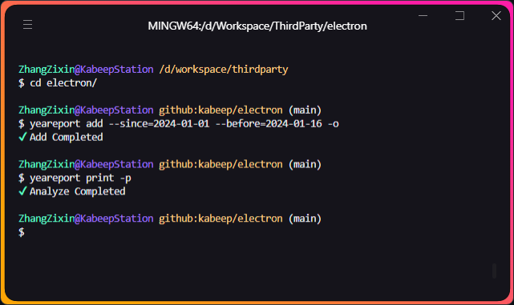

<h1 align="center"> yeareport </h1>
<p align="center">
  <b>年末レポートのための git commit をまとめる NodeJS ツール、Markdown を自動生成</b>
</p>

---

<div align="center">


[](LICENSE)

[English](README.md) | [简体中文](README.zh-CN.md) | 日本語 | [हिंदी](README.hi-IN.md)

</div>

## 📖 概要

`year-report` は個人向けの年末レポート作成を支援するツールです。

> これにより、次のことができます：
>
> - 個人の git ワークログをまとめる
>
> - 美しい Markdown を出力する
>
> - 特定の作業タイプのコンテンツリストと数量を抽出する
>
> changelog-cli との違い：
>
> - 個人向けに特化
>
> - 柔軟で制御可能な時間範囲
>
> - より多くの制御可能な出力結果モード
>
> - 開発者の年末レポート用により良い標準素材を設計
>
> - GPT へのデータ供給のための事前解析

[Markdown](example/example.md) 出力結果のデモ


## ⚙️ インストール

1. リポジトリをクローンする

```shell
git clone https://github.com/kabeep/yeareport.git
```

2. 依存関係をインストールする

```shell
cd yeareport

# NPM
npm install

# または Yarn
yarn
```

3. プログラムをコンパイルする

```shell
npm run build
```

4. NPM ソフトリンク

```shell
npm link
```

5. インストールの成功をテストする

```shell
yeareport -v
```

## 🚀 例を使用する



```text
yeareport <command> [options]

命令：
  yeareport add     現在のディレクトリをキューに追加
  yeareport remove  現在の作業ディレクトリをキューから削除         [aliases: rm]
  yeareport clear   キューをクリア                                [aliases: clr]
  yeareport print   キューをマークダウンファイルとして出力        [aliases: ptr]
  yeareport show    キュー内のログリストを表示

选项：
      --author     `auto`の場合、git global
                   configから検索、デフォルトはすべてのログを出力       [もじれつ]
      --since      特定の日から出力開始、デフォルトは `2023-01-01`      [もじれつ]
      --before     特定の日まで出力終了、デフォルトは `2024-01-01`      [もじれつ]
      --output     print 出力ディレクトリ、現在の作業ディレクトリに対して相対的
                   、デフォルトは `User/Downloads`                      [もじれつ]
  -o, --overwrite  add 上書き許可、現在の作業ディレクトリが既に存在する場合に上
                   書き操作を実行                         [ブール] [デフォルト値: false]
  -p, --pretty     print タイトルを美化、emojiを使ってMarkdownのタイトルを美化
                                                          [ブール] [デフォルト値: false]
  -h, --help       显示帮助信息                                           [ブール]
  -v, --version    显示版本号                                             [ブール]

示例：
  yeareport add -o                          現在の作業ディレクトリのログがキュー
                                            内に既にある場合に上書きするためのad
                                            dコマンドの承認
  yeareport add --author=kabeep             著者kabeepのログのみをキューに追加
  yeareport add --since=2023-01-01          2023-01-01から2024-01-01までのログを
  --before=2024-01-01                       キューに追加
  yeareport print -p                        Markdownのタイトルは `# {emoji}
                                            {commit-type}` として出力されます
```

## 🤝 貢献

プルリクエストや[Issues](https://github.com/kabeep/git-short-dir-prompt/issues)を通じて、あなたのアイデアやコードを貢献することを歓迎します。

## 📄 ライセンス

このプロジェクトは MIT ライセンスを採用しています。詳細は [LICENSE](LICENSE) ファイルをご覧ください。
