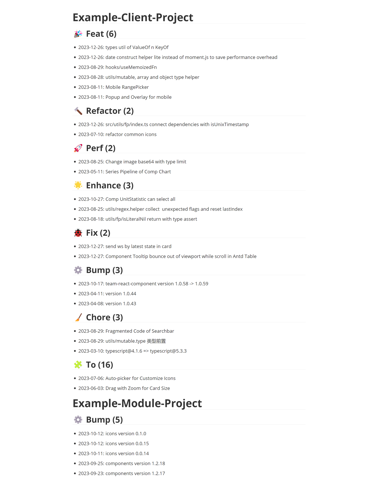

<h1 align="center"> yeareport </h1>
<p align="center">
  <b >为年终报告总结 git commit 的 NodeJS 小工具，自动化生成 Markdown</b>
</p>

---

<div align="center">


[](LICENSE)

[English](README.md) | 简体中文

</div>

## 📖 简介

`year-report` 是一个专注服务于个人、辅助撰写年终报告的工具。

> 它能够帮你：
>
> - 归纳个人的 git 工作日志
>
> - 输出优美的 Markdown
>
> - 提炼指定工作类型的内容列表与数量
>
> 它与 changelog-cli 有什么不同：
> 
> - 专注服务于个人
>
> - 灵活可控的时间范围
> 
> - 更多可控的输出结果模式
> 
> - 为开发者撰写年终报告设计的更好的标准材料
> 
> - 为 GPT 的投喂数据进行预解析

[Markdown](example/yeareport_1705018390501.md) 输出结果演示



## ⚙️ 安装

1. 克隆仓库

```shell
git clone https://github.com/kabeep/yeareport.git
```

2. NPM 软链接

```shell
cd yeareport

npm link
```

3. 测试安装成功

```shell
yeareport -v
```

## 🚀 使用

```text
yeareport <command> [options]

命令：
  yeareport add     将当前目录添加至待印队列，可选参数：[--overwrite]
  yeareport remove  将当前工作目录从待印队列移除                   [aliases: rm]
  yeareport clear   清空待印队列                                  [aliases: clr]
  yeareport print   将待印队列中的文件打印成 markdown 文件，输出到 `User/下载/yeareport_xxx.md`，可选参数：[--pretty, --type-first, --type-only]                    [aliases: ptr]
  yeareport show    读取待印队列中的项目列表

选项：
  -n, --username    [git commit] 使用的用户名， 默认为 `git config --global username`  [数组]
  -d, --date        [git log] 的 `--since` 参数，默认为上一年的 `01-01`                [字符串]
  -o, --overwrite   待 add 的项目日志已存在时进行覆写操作                                [布尔] [默认值: false]
      --output      print 命令的输出目录，相对于当前工作目录，默认`User/Downloads`         [字符串]
  -p, --pretty      使用 emoji 美化 print 的提交类型标题                               [布尔] [默认值: false]
      --type-first  使用提交类型分组的 print 方式而非项目分组，优先级大于 --type-only       [布尔] [默认值: false]
      --type-only   传入此参数则只 print 该类型的工作内容，优先级小于 --type-first         [字符串]
  -h, --help        显示帮助信息                                                     [布尔]
  -v, --version     显示版本号                                                       [布尔]

示例：
  yeareport add -n yourname                 输出 `yourname` 的 commit 提交日志，默认 git config global 的 user.name
  yeareport add -d 2024-01-01               输出 `2024-01-01` 到今天的全部日志，默认 last_year-01-01
  yeareport add -o                          如果待印队列中已存在当前工作目录的项目，程序将根据 `--overwrite` 参数决定抛出异常/覆写
  yeareport print -p                        当存在此项，二级标题将输出：## {commit-type-emoji} {commit-type}
  yeareport print --type-first              最终 markdown 输出以 `项目 > 提交类型 > 列表` 分节
  yeareport print --type-first              最终 markdown 输出以 `提交类型 > 项目 > 列表` 分节，不兼容 --type-only 参数
  yeareport print --type-only               最终 markdown 仅输出匹配类型的 commit 且以 `项目 > 列表` 分节，不兼容 `--pretty` 参数
  yeareport add -n zhangzixin -d 2023-01-28 && yeareport ptr -p --type-first
                                            输出`zhangzixin`从`2023-01-28`到今天的提交日志为markdown且以`提交类型 > 项目 > 列表`分节到`User/Downloads`目录
```

## 🤝 贡献

欢迎通过 Pull Requests 或 [Issues](https://github.com/kabeep/git-short-dir-prompt/issues) 来贡献你的想法和代码。

## 📄 许可

本项目采用 MIT 许可证。详情请见 [LICENSE](LICENSE) 文件。